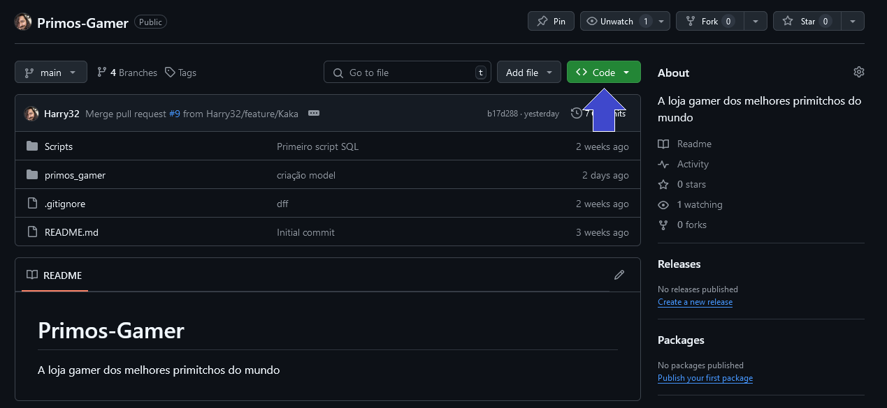
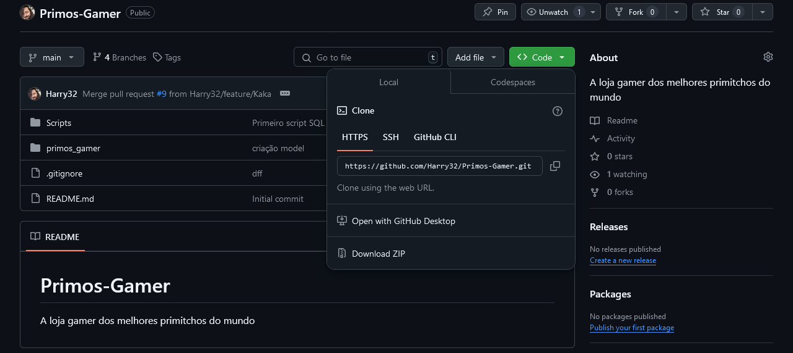
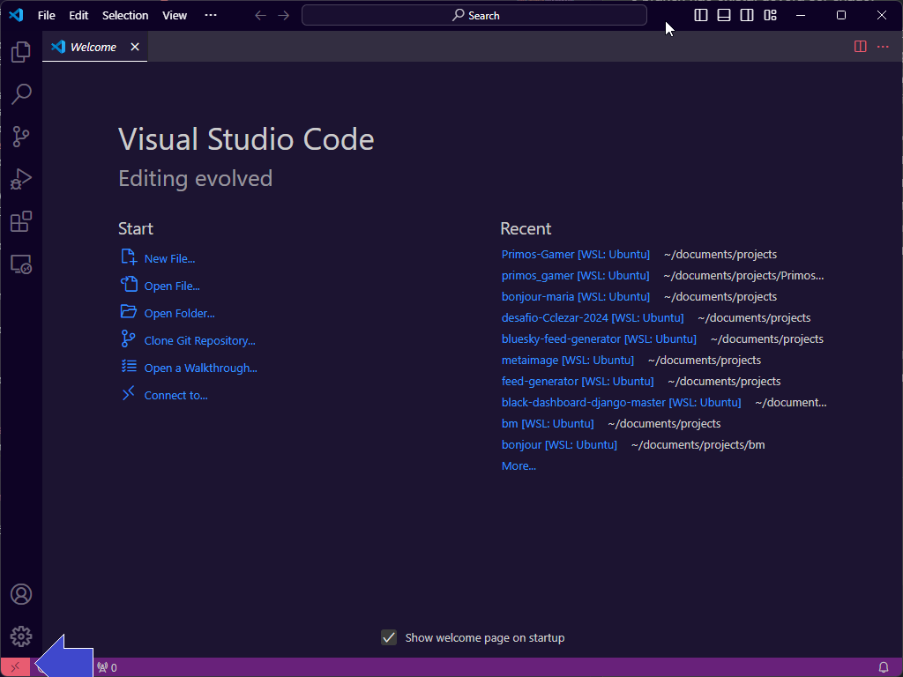
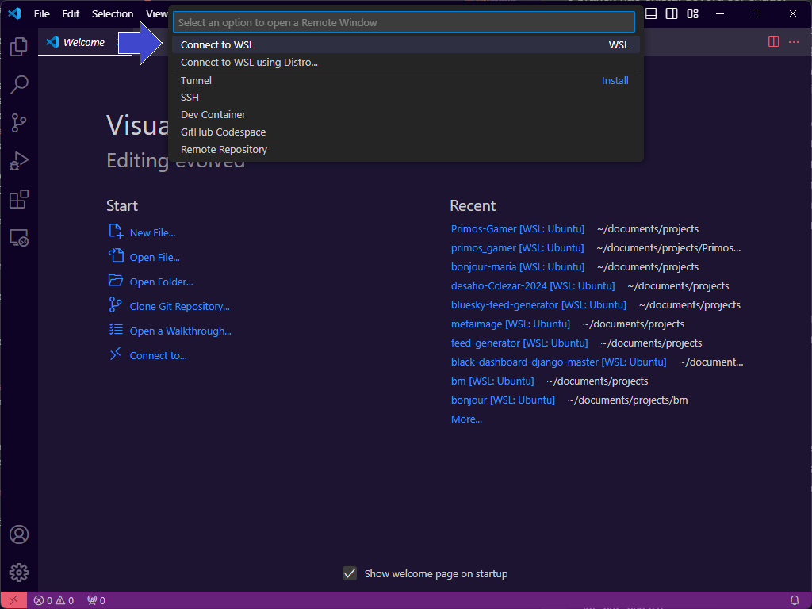
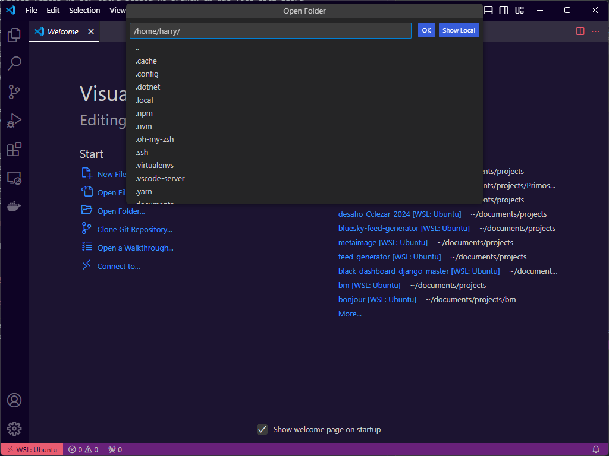

# Configurando o ambiente:
Aqui vamos ver o que é necessário para configurar o ambiente linux para rodar a aplicação.

## Pasta de projetos
Esse passo é opcional, mas você pode querer separar seus projetos em uma pasta. Para criar uma pasta `mkdir` seguido do nome da pasta desejada. Então se queremos criar uma pasta chamada "projetos" por exemplo, execute o comando `mkdir projetos`. Fique a vontade para criar a estrutura de pastas que achar melhor

## Baixando o projeto
Como ainda não temos nada para acessar via Visual Studio Code, vamos executar o comanado de clone. Se você criou a pasta de projetos, entre nela com o comando `cd projetos`. Depois execute o comando `git clone` seguido do link de clonagem do projeto.

Para conseguir o link vá até a página do projeto e clique no botão verde escrito *<> Code* como mostra a imagem abaixo:



Na janelinha flutuante que aparecer, certifique-se que a aba HTTPS está selecionada e copie o link.



Depois basta executar o comando `git clone https://<link>` que o código será baixado. Lembre-se que todo código é baixado da branch **main**.


## VENV
Antes de entrarmos nos projeto precisamos configurar a nossa VENV.

VENV ou Virtual Environment é uma ferramenta que permite instalar bibliotecas do python para apenas um projeto específico, não vários. Se você instalar um pacote do python sem VENV ele estará disponível na sua máquina como um todo. Isso pode ser um problema quando você tem mais de um projeto, um projeto pode estar usando o Django na versão 5.1.2 e outro na versão 4.3.7. Como você teria apenas uma versão do Django para todos os projetos, um deles não rodaria.

Para resolver isso criamos sempre uma VENV para cada projeto que trabalhamos. Pense nela como uma pasta de biblioteca para seu projeto. Vamos começar criando na pasta atual (fora da pasta do projeto Primos-Gamer) uma pasta apenas para nossas futuras VENVs. Execute o comando `mkdir venvs`.

Agora vamos instalar o venv. No linux o primeiro passo é executar o comando que atualiza a biblioteca de pacotes do sistema. Basta executar o comando `apt-get update`. Após o update podemos fazer a instalação com `apt-get install python3-virtualenv`. Você vai ver que vai ser perguntado se deseja instalar alguns pacotes. Basta digitar a resposta equivalente para permitir (normalmente Y ou YES). Se quiser instalar sem que seja perguntado basta colocar a propriedade **-y** no comando, ficando assim? `apt-get -y install python3-virtualenv`.

Com o pacote agora instalado podemos criar a VENV para o projeto executando o comando `python3 -m venv ./venvs/Primos-Gamer`. Finalmente nós vamos ativar a nossa VENV executando o comando. Podemos ativar a partir da pasta que estamos agora, mas como normalmente será executado de dentro da pasta do projeto vamos fazer isso. Entre na pasta do projeto (executando `cd Primos-Gamer`) e depois execute `source ../venvs/Primos-Gamer/bin/activate`. Você verá que agora no seu terminal há um parêntese ao lado esquerdo da linha atual com o nome da VENV ativa *"(Primos-Gamer)"*

## Utilizando o Git
Nesse momento estamos na branch **main**. Mas para trabalhar precisaremos usar nossos próprios branches. Todo branch para desenvolver novas funcionalidades deve partir da branch de desenvolvimento, então vamos precisar primeiro baixar essa branch.

Lembre-se que existem dois ambientes no git, o ambiente local (que está na sua máquina) e o ambiente remoto ou origin (que está no servidor do github). Ao criar um novo branch é necessário dizer de onde ele surge. Execute o comando `git checkout -b <nome_branch> origin <branch_remoto>`. Onde <nome_branch> é o nome que o branch local terá. É recomendado que o nome seja o mesmo do branch remoto para evitar confusão. E <branch_remoto> é o nome do branch remóto. Como vamos baixar a develop o código ficará assim: `git checkout -b develop origin/develop`.

O comando **checkout** faz a mudança pro branch que você escolher. A propriedade **-b** indica que caso o branch não exista, deverá ser criado.

Agora vamos criar nosso novo branch que terá origem na develop. O comando será igual, a única diferença é que não precisamos dizer a origem, pois já estamos no branch que queremos que seja a origem: `git checkout -b feature/<meu_branch>`. O nome *feature* é uma convenção para entendermos que esse branch é usado para criar novas funcionalidades.

Para enviar o branch para o servidor basta executar o comando `git push`. Para pegar alterações feitas no por outra pessoa no branch em que você está agora execute `git pull`. Após fazer alterações você precisará mandar as mudanças para o servidor, o primeiro passo é marcar os arquivos para envio. Essa marcação é chamado de *staging*, para fazer isso execute `git add .`. Agora vamos criar um commit, que é a identificação da nossa mudança. Faça isso executando o comando `git commit -m <titulo>`. O parâmetro *-m* é obrigatório, ele diz que o valor após ele é o título do commit e essa informação é obrigatória. Não esqueça que o  título deve ser escrito entre aspas: `git commit -m "Título de exemplo"`.

[!NOTE]
Sempre que fizer algo funcional faça um commit e envie para o servidor com o comando **push** para garantir que fique salvo e que todos possam ver.

[!WARNING]
Não esqueça de antes de dar um **push** para enviar seus commits, dar um **pull** para baixar quaisquer mudanças realizadas por outras pessoas. Caso haja mudanças para baixar o git não permitirá envar as mudanças. Caso você use o botão "Sincronizar" no VSCode, os dois comandos são feitos automaticamente.

## Visual Studio Code
Para configurar o VSCode será necessário apenas instalar duas extensões: WSL e Python. Após instalar as duas você precisará abrir o projeto. Lembre que o projeto só estará acessível após abrir o linux no terminal. Primeiro será necessário abrir a janela remota que permite acesso ao código em outro sistema. No canto inferior esquerdo do seu VSCode terá um quadrado vermelho clique nele.



E um dropdown irá aparecer no centro superior do VSCode perguntando a ação desejada. Selecione *Connect to WSL*.



Agora, no canto inferior esquerdo você verá o nome WSL: Ubuntu. Agora vá em Arquivo e clique em Abrir Pasta. No centro superior você poderá escolher a pasta do projeto, mas se você prestar atenção verá que as pastas não parecem com as suas pastas do Windows. Essas são as pastas do seu linux.



Procure a sua pasta de projeto e depois a pasta *Primos-Gamer* e depois a pasta *primos_gamer* e aperte o botão Ok. Agora você tem acesso ao projeto no VSCode.

## Comandos Utilizados

#### Comandos do Terminal
```bash
# Atualiza pacotes do linux
apt-get update

# Instala o VENV
apt-get install python3-virtualenv
```

#### Comandos do Git
```bash
# Clona um repositório git
git clone http://<link>

# Muda para um branch existente
git checkout <nome_branch>

# Muda para um novo branch, criado a partir do branch local atual
git checkout -b <nome_branch>

# Muda para um novo branch, criado a partir de um branch remóto especificado
git checkout -b <nome_branch> origin <branch_remoto>

# Diz pro git que todos os arquivos alterados devem ser mapeados
git add .

# Cria um commit com todos os arquivos marcados (no comando anterior)
git commit -m "Titulo do meu commit"

# Busca alterações do branch remoto
git pull

# Envia alterações pro servidor
git push
```