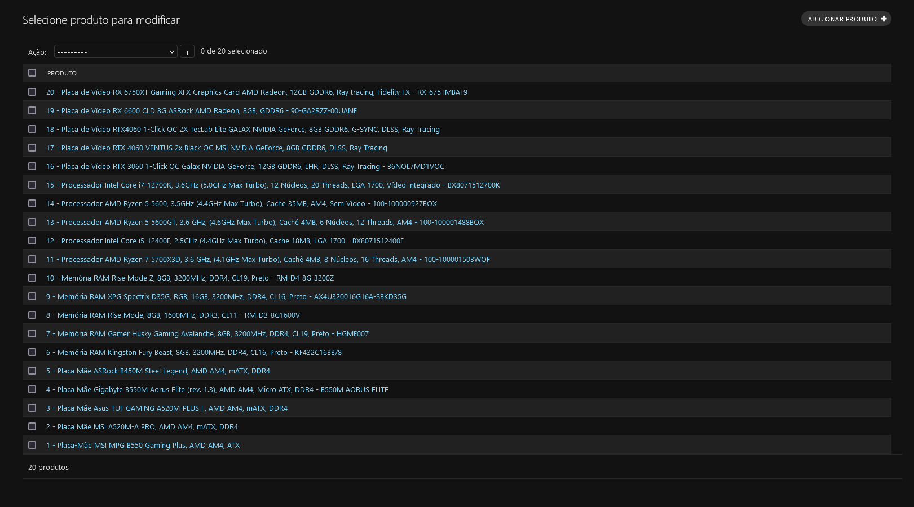
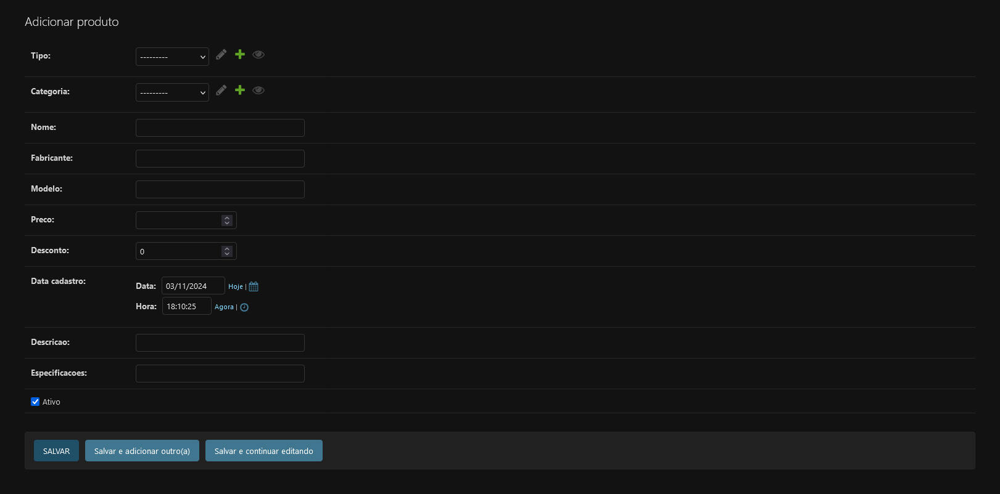
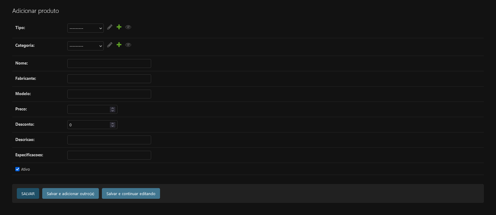
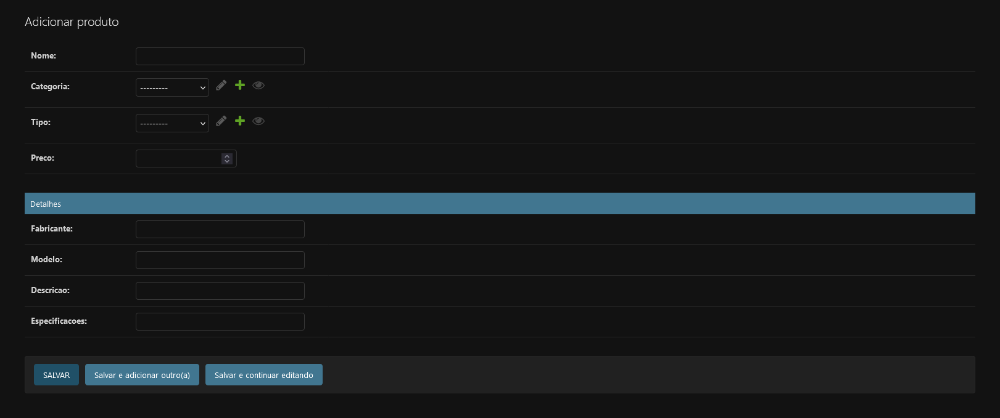

# Utilizando o Django
Aqui vamos entender como utilizar o django para desenvolvermos nossos projetos.

## Sobre o Django
O Django é um framework para desenvolvimento de aplicações web utilizando python. Ele contém todas as ferramentas necessárias para criar projetos completos. Nele vamos fazer comunicação com bancos de dados, montagem de telas automáticas, montagem de telas manuais dinâmicas e tratamento de segurança.

## Estrutura
Todo projeto Django possui uma pasta com o nome do projeto (primos_gamer) e um arquivo chamado *manage.py*.


O arquivo manage.py é onde executaremos os comandos básicos do Django, que nos permitirá desenvolver o projeto. Já na pasta com o nome do projeto temos alguns arquivos usados para configuração do sistema. O principal deles é o *settings.py* que contém todas as configurações do projeto.

Nós vamos realizar alterações no arquivo settings ao longo do projeto, por hora vamos realizar apenas duas alterações. A primeira é definir o idioma na variável **LANGUAGE_CODE** e a segunda definir o fuso horário na variável **TIME_ZONE**. Altere essas variáveis para que fique assim:
```python
LANGUAGE_CODE = 'pt-BR'

TIME_ZONE = 'America/Sao_Paulo'
```

## Apps
O django funciona separando partes diferentes do sistema em módulos chamados de **Apps**. Dentro de cada **App** teremos uma estrutura de arquivos que nos permitirá fazer tudo o que precisamos no projeto.

No nosso projeto, nesse primeiro momento, teremos 3 **Apps**. Um para tratarmos de produtos, um para tratarmos de clientes e um para tratarmos de pedidos. Conforme o projeto for avançando vamos criando mais **Apps**.

Para criar um novo app vamos utilizar o comando `python manage.py startapp <nomeapp>`.

## Instalando Dependências
Você deve ter percebido a existência de um arquivo abaixo do manage.py chamado requirements.txt. Nele temos todas as bibliotecas que precisam ser instaladas pro nosso projeto com a versão que precisamos. Estando dentro da VENV, execute o comando `pip install -r requirements.txt` para instalar os pacotes que permite executar o projeto.

>[!WARNING]
>Não esqueça de estar dentro do VENV quando for instalar pacotes. Se tiver dúvida veja [como ativar o VENV aqui](./CONFIG.md#comandos-do-venv).

## Models
Os models são classes que representam estruturas do nosso banco de dados. Cada model será uma tabela no nosso banco com todas as colunas e relacionamentos como nós definimos no model. Além disso, é através dos models que vamos realizar consultas no banco. O Django nos permite realizar alterações no banco e nos dados, assim como consultas, sem acessar o banco e escrever scripts SQL. Essa abstração é o que chamamos de ORM (Object-Relational Mapping).

### Criando um Model
Dentro de cada **App** nós temos um arquivo chamado *model.py*. Nele vamos criar classes que herdam de uma classe comum chamada **Model**. Vamos começar criando o nosso model para Categoria:
```python
class Categoria(models.Model):
    pass
```

>[!TIP]
>Como o python não utiliza chaves para delimitar o começo e fim de um bloco, quando criamos uma função ou classe vazia temos que usar o comando **pass**, para que o python entenda que aquele bloco de código acaba ali.

No python nós representamos herança colocando a classe mãe entre parênteses após o nome da classe. Nesse caso herdamos da classe **Model** que está dentro da referência *models*.

Agora vamos criar as colunas. Na prática não é necessário criar a coluna da chave primária, pois o django faz isso automaticamente. Mas para que a gente se acostume com a necessidade de criar essa coluna, vamos sempre criar. Também vamos criar uma coluna de texto que será o nome da nossa categoria.
```python
class Categoria(models.Model):
    id = models.SmallAutoField(primary_key=True)
    nome = models.CharField(max_length=50)
```
>[!NOTE]
>Para que o id seja gerado automaticamente temos os tipos **AutoField**. A cada novo item adicionado no banco ele gera um id sequencial para este item.

Cada coluna é definida pelos tipos **Field**. podendo ser **CharField**, **DecimalField**, **BooleanField** entre outros. Cada um tem parâmetros específicos que podem e/ou devem ser utilizados. Abaixo você terá uma lista reduzida de tipos, mas se quiser a lista completa pode acessar [essa documentação oficial do Django](https://docs.djangoproject.com/en/5.1/ref/models/fields/).

Quando as tabelas forem criadas os nomes das tabelas e das colunas seguem um padrão pré definido. O nome das tabelas, por exemplo, é criado concatenando o nome do **App** e o nome do model. Nesse nosso exemplo o nome da tabela criada seria produtos_categoria.

O problema disso é que há situações em que os nomes podem ser confusos. Se nesse mesmo **App** nós tivermos um model chamado CategoriaProduto o nome da tabela produtos_categoria_produto. Se existir uma entidade-relacionamento desse model com o model de Produto nós chamaremos de CategoriaProduto_Produto, fazendo com que o nome da tabela seja produtos_categoria_produtos_produtos. É fácil ver como pode ficar confuso com o tempo.

Para evitar esse tipo de situação vamos definir o nome da tabela manualmente. Para isso vamos criar uma classe interna chamada **Meta**, que permite realizar configurações mais complexas nos models. Nesse caso, vamos definir o nome da tabela utilizando a variável **db_table**.

```python
class Categoria(models.Model):
    id = models.SmallAutoField(primary_key=True)
    nome = models.CharField(max_length=50)


    class Meta:
        db_table = "Categoria"
```

>[!TIP]
>Classes internas são classes criadas dentro de outras para agrupar classes de comportamentos comuns que precisa estar em um escopo específico.

### Models com Relacionamentos
Para criar um relacionamento vamos usar um tipo chamado **ForeignKey**. Nele nós precisamos informar duas coisas: O objeto com o qual criaremos o relacionamento e o que deve acontecer quando o registro que contém esse relacionamento for deletado.

```python
class Municipio(models.Model):
    id = models.AutoField(primary_key=True)
    estado = models.ForeignKey(Estado, on_delete=models.CASCADE)
    codigo = models.IntegerField()
    nome =  models.CharField(max_length=100)


    class Meta:
        db_table = "Municipio"
```
>[!TIP]
>Sempre que fazemos uma referência direta de uma classe, como fazemos referenciando a classe **Estado** na ForeignKey, a classe precisa estar declarada antes dessa linha. Mas há situações em que vamos precisar criar referências à classes que foram criadas abaixo da linha, quando isso acontecer basta passar o parâmetro como string, em vez da referência da classe.

>[!TIP]
>O tipo ForeignKey deve estar na tabela que precisa ter a coluna de chave estrangeira.

### Criando o Banco
Para criar o banco de dados precisamos pedir para o Django converter nossos models para scripts e depois executar os scripts. Essa geração é chamada de migrations. Arquivos que mapeiam todas as mudanças que fazemos na estrutura do nosso banco.

Primeiro vamos executar o comando `python manage.py makemigrations`, que irá gerar arquivos que descrevem como os scripts devem ser gerados. Esses arquivos são encontrados nas pastas *migrations* dentro de cada **App**.

Em seguida executamos o comando `python manage.py migrate`, esse comando vai executar os scripts, esse é o comando que realmente realiza a mudança.

É importante lembrar que o Django não consegue saber a intenção de cada mudança. Por isso, caso um conflito ocorra ele perguntará o que deve fazer ou não realizará a mudança. Se for feita uma mudança que adiciona uma coluna em uma tabela existente o Django irá perguntar qual o valor deverá ser inserido nas linhas que já existem naquela tabela. Ele irá perguntar, mesmo que a tabela está vazia.

### Tipos de Campos
| Campo            | Descrição   |
| ---------------- | ----------- |
| SmallAutoField     | Valor incremental que vai de 1 à 32767               |
| AutoField          | Valor incremental que vai de 1 à 2147483647          |
| BigAutoField       | Valor incremental que vai de 1 à 9223372036854775807 |
| SmallIntegerField  | Valor inteiro que vai de -32768 à 32767             |
| IntegerField       | Valor inteiro que vai de -2147483647 à 2147483647           |
| BigIntegerField    | Valor inteiro que vai de -9223372036854775808  à 9223372036854775807  |
| DecimalField       | Valor numérico que permite o uso de casas decimais  |
| DateTimeField      | Coluna que armazena Data e Hora                     |
| EmailField         | Coluna que armazena apenas emails                   |
| BooleanField       | Coluna que armazena apenas um valor booleano        |
| ForeignKey         | Define um relacionamento 1 para vários              |
| OneToOneField      | Define um relacionamento 1 para 1                   |
| ManyToManyField    | Define um relacionamento vários para vários         |


### Fixtures
Fixtures é uma ferramenta que permite salvarmos os dados em arquivos para dar a carga inicial do nosso projeto. Você vai perceber que há um arquivo chamado *fixtures.json* no nosso projeto. Hoje nós temos nele registros para as seguintes tabelas:

- Categoria
- TipoProduto
- Cliente
- Endereço
- Usuário
- Estado
- Municipio

Para fazer a carga do seu banco com esses dados, basta executar o comando `python manage.py loaddata fixtures.json`.

### Queries
Para realizar consultas no banco nós utilizamos algumas funções do próprio django. Para começar basta usar a classe models que deseja. Segue alguns comandos que podemos utilizar:

```python
# Cria um objeto do model Categoria
minha_categoria = Categoria(nome='Peças')

# Insere o nosso objeto no banco de dados
minha_categoria.save()

# Realiza alterações na categoria
minha_categoria.nome = 'Periféricos'

# Salva a alteração no banco de dados
minha_categoria.save()

# Deleta uma categoria
minha_categoria.delete()

# Consulta apenas um objeto do banco de dados (Pode ser consultado pelo id ou pra qualquer propriedade, contanto que haja apenas um item correspondente no banco)
outra_categoria = Categoria.objects.get(id=1)

# É possível alterar um objeto sem necessariamente salvar em uma variável
Categoria.objects.get(id=1).update(nome='Periféricos')

# Obtém todos os itens do banco
Categoria.objects.all()

# Obtém vários itens que atendem um filtro especifico
Produtos.objects.filter(categoria=1)

```

Para mais informações de como criar queries acesse [a documentação do django](https://docs.djangoproject.com/en/5.1/topics/db/queries/).

## Django Admin
O Django Admin é a ferramenta que nos permite gerar telas automáticas baseado apenas nos models que criamos. Mas primeiro, antes de começar precisamos criar um usuário para utilizar o sistema. Para isso, basta executar o comando `python manage.py createsuperuser`, ele vai te pedir um nome de usuário, email e senha.

>[!WARNING]
>Não é necessário criar um usuário se você carregou as Fixtures. Caso tenha carregado o usuário é *admin* e a senha *123456*

Depois precisamos dizer pro django quais models devem poder ser cadastrados no nosso admin. Para isso vá até o arquivo *admin.py* do **App** desejado e adicione o comando que registra o model no admin.
```python
admin.site.register(Categoria)
```

Para visualizar o admin basta acessar a url `http://localhost:8000/admin` e logar com o usuário e senha criados. Você conseguirá ver a lista de todos os models cadastrados separados por **App**.


### Listagens

Caso queira criar comportamentos específicos para a página do admin podemos criar uma classe para definir esses comportamentos.

```python
@admin.register(Produto)
class ProdutoAdmin(admin.ModelAdmin):
    pass
```

>[!NOTE]
>O comando com @ logo acima da classe é o que chamamos de *Decorator*. Uma propriedade que colocamos acima de uma classe ou função para adicionar, mudar ou remover comportamentos específicos.

Se olharmos a tela do admin agora veremos que não há diferença de como era antes.



Podemos escolher que informações de produtos aparecerão nessa listagem definindo a variável **list_display** com a lista de propriedades do nosso model que queremos que apareça na listagem.

```python
@admin.register(Produto)
class ProdutoAdmin(admin.ModelAdmin):
    list_display = ['nome', 'tipo', 'categoria', 'data_cadastro', 'ativo']
```

Se olharmos a tela agora veremos que há mais informações:


Nós podemos também criar filtros para ver apenas os itens que queremos. Para isso vamos definir a variável **list_filter** com a lista de propriedades que vamos usar no filtro. No caso de precisar de filtros para datas é necessário apontar o uso do filtro de data.

```python
@admin.register(Produto)
class ProdutoAdmin(admin.ModelAdmin):
    list_display = ['nome', 'tipo', 'categoria', 'data_cadastro', 'ativo']
    list_filter = ['tipo', 'categoria', ('data_cadastro', admin.DateFieldListFilter), 'ativo']
```


Podemos também criar paginações para que tenhamos uma visão menor e mais focada. Para isso só precisamos definir a variável list_per_page com a quantidade de itens por página.

```python
@admin.register(Produto)
class ProdutoAdmin(admin.ModelAdmin):
    list_display = ['nome', 'tipo', 'categoria', 'data_cadastro', 'ativo']
    list_filter = ['tipo', 'categoria', ('data_cadastro', admin.DateFieldListFilter), 'ativo']
    list_per_page = 5
```


### Formulários
Podemos definir também o que deve aparecer nos formulários de inserção e alteração do produto. Caso não haja definição o django vai deixar tudo ser inserido:



Nesse exemplo temos que inserir a data de cadastro, o que não faz sentido. Então vamos definir a variável **exclude** e definir nela o que não queremos que apareça no formulário.

```python
@admin.register(Produto)
class ProdutoAdmin(admin.ModelAdmin):
    list_display = ['nome', 'tipo', 'categoria', 'data_cadastro', 'ativo']
    list_filter = ['tipo', 'categoria', ('data_cadastro', admin.DateFieldListFilter), 'ativo']
    list_per_page = 5

    exclude = ['data_cadastro']
```



Podemos também utilizar a variável **fieldsets** para separar a tela em seções para deixar o formulário mais organizado.

```python
@admin.register(Produto)
class ProdutoAdmin(admin.ModelAdmin):
    list_display = ['nome', 'tipo', 'categoria', 'data_cadastro', 'ativo']
    list_filter = ['tipo', 'categoria', ('data_cadastro', admin.DateFieldListFilter), 'ativo']
    list_per_page = 5

    exclude = ['data_cadastro']
    fieldsets = [(None, { 'fields': ['nome', 'categoria', 'tipo', 'preco'] }),
                 ('Detalhes', { 'fields': ['fabricante', 'modelo', 'descricao', 'especificacoes'] })]
```



## Actions
Se voltarmos para a tela de listagem podemos ver um dropdown acima da lista de produtos chamado *Ações*. Ali podemos definir ações que serão executadas para todos os itens da listagem que marcarmos. Podemos ver que a única opção presente ali é a de remover o produto.

Vamos começar removendo essa opção, pois não queremos que os produtos sejam deletados, queremos que sejam desativados. Para isso, só precisamos remover a permissão de remover itens nessa página.

```python
@admin.register(Produto)
class ProdutoAdmin(admin.ModelAdmin):
    list_display = ['nome', 'tipo', 'categoria', 'data_cadastro', 'ativo']
    list_filter = ['tipo', 'categoria', ('data_cadastro', admin.DateFieldListFilter), 'ativo']
    list_per_page = 5

    exclude = ['data_cadastro']
    fieldsets = [(None, { 'fields': ['nome', 'categoria', 'tipo', 'preco'] }),
                 ('Detalhes', { 'fields': ['fabricante', 'modelo', 'descricao', 'especificacoes'] })]
    
    def has_delete_permission(self, request: HttpRequest, obj: Any | None = ...) -> bool:
    """
        Função que verifica se o usuário tem permissão de deletar itens dessa página.
        Estou retornando falso para que não seja possível remover para essa página
    """
    return False
```
>[!NOTE]
>Essa três aspas triplas dentro da função é o que chamamos de *Docstring*, uma notação utilizada para documentar uma função ou classe, descrevendo seu funcionamento e seus parâmetros.

Para criarmos nossas próprias actions precisamos de duas coisas. A primeira é uma função que executa a action e a outra é preencher a variável **actions** com o nome da nossa função.

```python
@admin.register(Produto)
class ProdutoAdmin(admin.ModelAdmin):
    list_display = ['nome', 'tipo', 'categoria', 'data_cadastro', 'ativo']
    list_filter = ['tipo', 'categoria', ('data_cadastro', admin.DateFieldListFilter), 'ativo']
    list_per_page = 5

    exclude = ['data_cadastro']
    fieldsets = [(None, { 'fields': ['nome', 'categoria', 'tipo', 'preco'] }),
                 ('Detalhes', { 'fields': ['fabricante', 'modelo', 'descricao', 'especificacoes'] })]

    actions = ['desativar']
    
    def has_delete_permission(self, request: HttpRequest, obj: Any | None = ...) -> bool:
    """
        Função que verifica se o usuário tem permissão de deletar itens dessa página.
        Estou retornando falso para que não seja possível remover para essa página
    """
    return False

    @admin.action(description='Desativar produtos selecionados')
    def desativar(self, request: HttpRequest, queryset: QuerySet):
        """
            Função criada por mim para uma Action customizada que desativa produtos.
        """
        queryset.update(ativo=False)
```

>[!NOTE]
>O decorator action que usamos aqui define que nossa função será utilizada pelo Admin e o texto que dev aparecer no dropdown de actions.

Como ficou claro, nossa função atualiza os itens marcados na tela. Alterando a coluna *ativo* para False. Para saber que comando podem ser utilizados no queryset veja [a seção de queries](#queries).

## Comandos Utilizados

#### Comandos de Migrations
```bash
# Cria os migrations
python manage.py makemigrations

# Executa as alterações no banco
python manage.py migrate
```