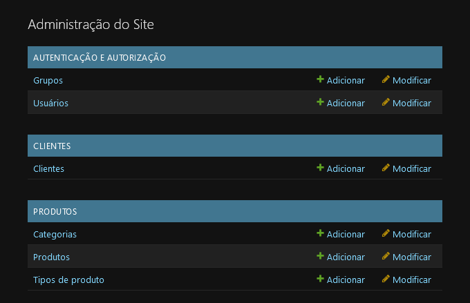
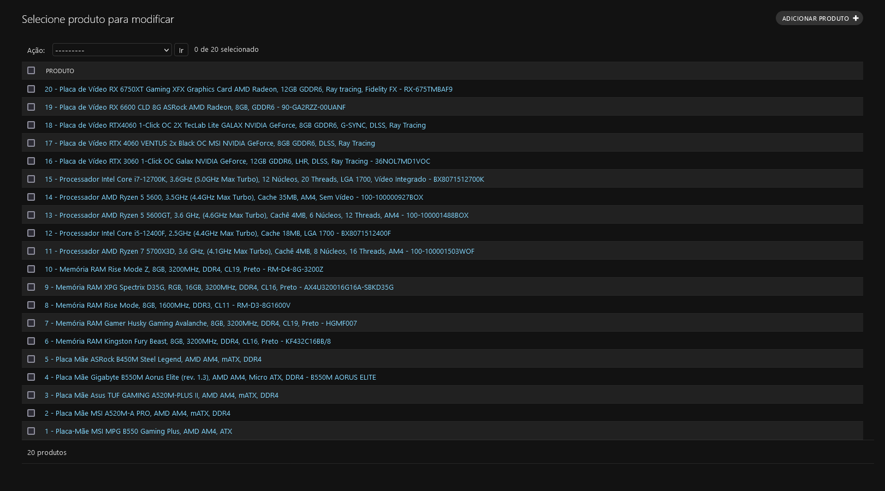
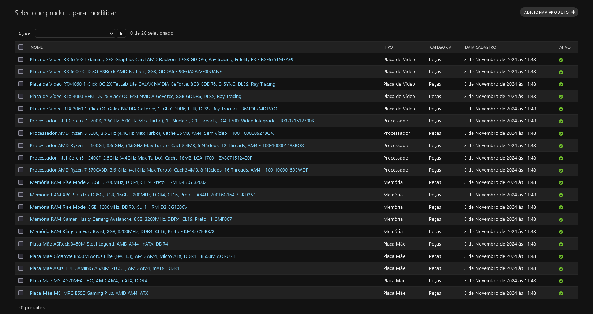
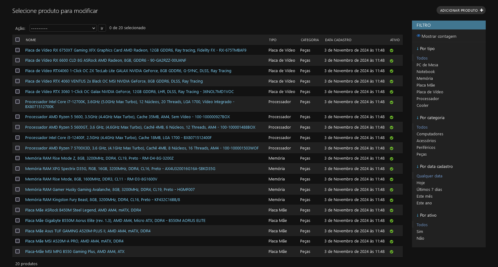
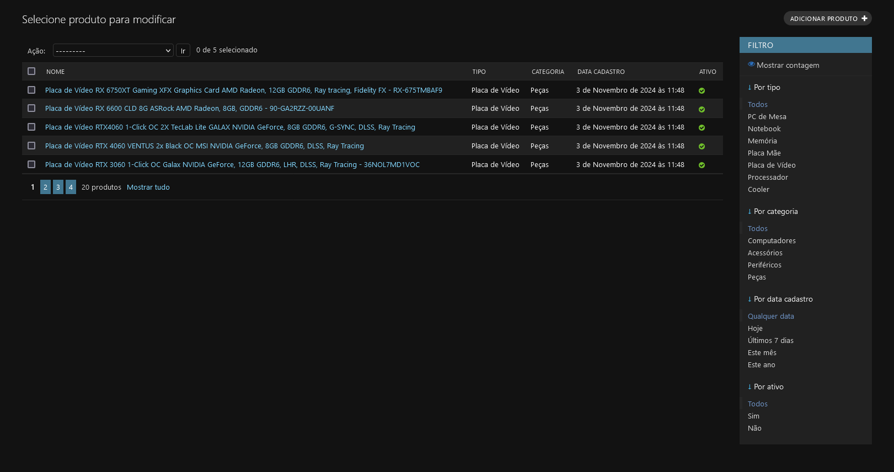
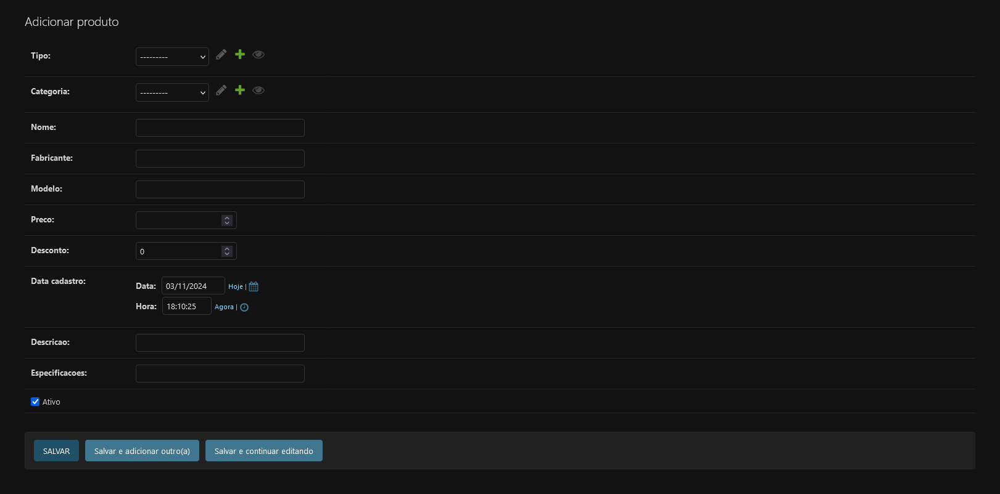
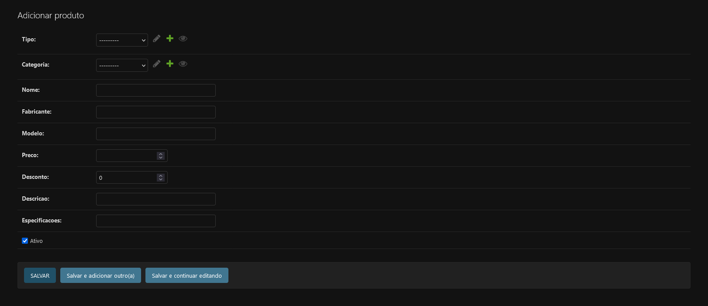
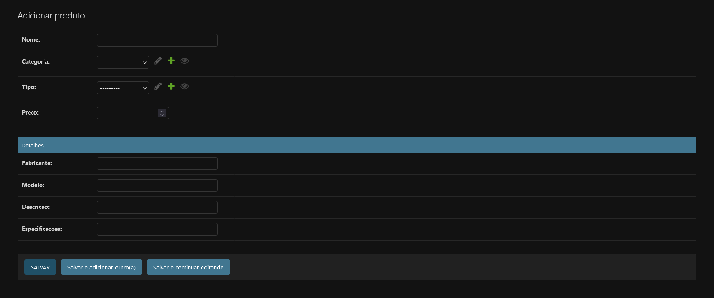

## Django Admin
O Django Admin é a ferramenta que nos permite gerar telas automáticas baseado apenas nos models que criamos. Mas primeiro, antes de começar precisamos criar um usuário para utilizar o sistema. Para isso, basta executar o comando `python manage.py createsuperuser`, ele vai te pedir um nome de usuário, email e senha.

>[!WARNING]
>Não é necessário criar um usuário se você carregou as Fixtures. Caso tenha carregado o usuário é *admin* e a senha *123456*

Depois precisamos dizer pro django quais models devem poder ser cadastrados no nosso admin. Para isso vá até o arquivo *admin.py* do **App** desejado e adicione o comando que registra o model no admin.
```python
admin.site.register(Categoria)
```

Para visualizar o admin basta acessar a url `http://localhost:8000/admin` e logar com o usuário e senha criados. Você conseguirá ver a lista de todos os models cadastrados separados por **App**.



### Listagens

Caso queira criar comportamentos específicos para a página do admin podemos criar uma classe para definir esses comportamentos.

```python
@admin.register(Produto)
class ProdutoAdmin(admin.ModelAdmin):
    pass
```

>[!NOTE]
>O comando com @ logo acima da classe é o que chamamos de *Decorator*. Uma propriedade que colocamos acima de uma classe ou função para adicionar, mudar ou remover comportamentos específicos.

Se olharmos a tela do admin agora veremos que não há diferença de como era antes.



Podemos escolher que informações de produtos aparecerão nessa listagem definindo a variável **list_display** com a lista de propriedades do nosso model que queremos que apareça na listagem.

```python
@admin.register(Produto)
class ProdutoAdmin(admin.ModelAdmin):
    list_display = ['nome', 'tipo', 'categoria', 'data_cadastro', 'ativo']
```

Se olharmos a tela agora veremos que há mais informações:



Nós podemos também criar filtros para ver apenas os itens que queremos. Para isso vamos definir a variável **list_filter** com a lista de propriedades que vamos usar no filtro. No caso de precisar de filtros para datas é necessário apontar o uso do filtro de data.

```python
@admin.register(Produto)
class ProdutoAdmin(admin.ModelAdmin):
    list_display = ['nome', 'tipo', 'categoria', 'data_cadastro', 'ativo']
    list_filter = ['tipo', 'categoria', ('data_cadastro', admin.DateFieldListFilter), 'ativo']
```



Podemos também criar paginações para que tenhamos uma visão menor e mais focada. Para isso só precisamos definir a variável list_per_page com a quantidade de itens por página.

```python
@admin.register(Produto)
class ProdutoAdmin(admin.ModelAdmin):
    list_display = ['nome', 'tipo', 'categoria', 'data_cadastro', 'ativo']
    list_filter = ['tipo', 'categoria', ('data_cadastro', admin.DateFieldListFilter), 'ativo']
    list_per_page = 5
```



### Formulários
Podemos definir também o que deve aparecer nos formulários de inserção e alteração do produto. Caso não haja definição o django vai deixar tudo ser inserido:



Nesse exemplo temos que inserir a data de cadastro, o que não faz sentido. Então vamos definir a variável **exclude** e definir nela o que não queremos que apareça no formulário.

```python
@admin.register(Produto)
class ProdutoAdmin(admin.ModelAdmin):
    list_display = ['nome', 'tipo', 'categoria', 'data_cadastro', 'ativo']
    list_filter = ['tipo', 'categoria', ('data_cadastro', admin.DateFieldListFilter), 'ativo']
    list_per_page = 5

    exclude = ['data_cadastro']
```



Podemos também utilizar a variável **fieldsets** para separar a tela em seções para deixar o formulário mais organizado.

```python
@admin.register(Produto)
class ProdutoAdmin(admin.ModelAdmin):
    list_display = ['nome', 'tipo', 'categoria', 'data_cadastro', 'ativo']
    list_filter = ['tipo', 'categoria', ('data_cadastro', admin.DateFieldListFilter), 'ativo']
    list_per_page = 5

    exclude = ['data_cadastro']
    fieldsets = [(None, { 'fields': ['nome', 'categoria', 'tipo', 'preco'] }),
                 ('Detalhes', { 'fields': ['fabricante', 'modelo', 'descricao', 'especificacoes'] })]
```



### Actions
Se voltarmos para a tela de listagem podemos ver um dropdown acima da lista de produtos chamado *Ações*. Ali podemos definir ações que serão executadas para todos os itens da listagem que marcarmos. Podemos ver que a única opção presente ali é a de remover o produto.

Vamos começar removendo essa opção, pois não queremos que os produtos sejam deletados, queremos que sejam desativados. Para isso, só precisamos remover a permissão de remover itens nessa página.

```python
@admin.register(Produto)
class ProdutoAdmin(admin.ModelAdmin):
    list_display = ['nome', 'tipo', 'categoria', 'data_cadastro', 'ativo']
    list_filter = ['tipo', 'categoria', ('data_cadastro', admin.DateFieldListFilter), 'ativo']
    list_per_page = 5

    exclude = ['data_cadastro']
    fieldsets = [(None, { 'fields': ['nome', 'categoria', 'tipo', 'preco'] }),
                 ('Detalhes', { 'fields': ['fabricante', 'modelo', 'descricao', 'especificacoes'] })]
    
    def has_delete_permission(self, request: HttpRequest, obj: Any | None = ...) -> bool:
    """
        Função que verifica se o usuário tem permissão de deletar itens dessa página.
        Estou retornando falso para que não seja possível remover para essa página
    """
    return False
```
>[!NOTE]
>Essa três aspas triplas dentro da função é o que chamamos de *Docstring*, uma notação utilizada para documentar uma função ou classe, descrevendo seu funcionamento e seus parâmetros.

Para criarmos nossas próprias actions precisamos de duas coisas. A primeira é uma função que executa a action e a outra é preencher a variável **actions** com o nome da nossa função.

```python
@admin.register(Produto)
class ProdutoAdmin(admin.ModelAdmin):
    list_display = ['nome', 'tipo', 'categoria', 'data_cadastro', 'ativo']
    list_filter = ['tipo', 'categoria', ('data_cadastro', admin.DateFieldListFilter), 'ativo']
    list_per_page = 5

    exclude = ['data_cadastro']
    fieldsets = [(None, { 'fields': ['nome', 'categoria', 'tipo', 'preco'] }),
                 ('Detalhes', { 'fields': ['fabricante', 'modelo', 'descricao', 'especificacoes'] })]

    actions = ['desativar']
    
    def has_delete_permission(self, request: HttpRequest, obj: Any | None = ...) -> bool:
    """
        Função que verifica se o usuário tem permissão de deletar itens dessa página.
        Estou retornando falso para que não seja possível remover para essa página
    """
    return False

    @admin.action(description='Desativar produtos selecionados')
    def desativar(self, request: HttpRequest, queryset: QuerySet):
        """
            Função criada por mim para uma Action customizada que desativa produtos.
        """
        queryset.update(ativo=False)
```

>[!NOTE]
>O decorator action que usamos aqui define que nossa função será utilizada pelo Admin e o texto que dev aparecer no dropdown de actions.

Como ficou claro, nossa função atualiza os itens marcados na tela. Alterando a coluna *ativo* para False. Para saber que comando podem ser utilizados no queryset veja [a seção de queries](./DJANGO_MODELS.md#queries).