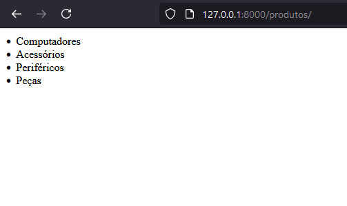

# Templates
Agora vamos aprender a criar páginas mais complexas e com montagem dinâmica.

## Introdução
Templates são os arquivos HTML que serão utilizados para montar nossas páginas. Mas diferente de arquivos HTML comuns eles podem ser utilizados com código do Django para serem montados de forma dinâmica.

## Criando o primeiro Template
Vamos começar criando uma pasta `templates` dentro do nosso **App** e depois criando dentro dessa pasta um arquivo chamado `list.html`. O django procura os templates dentro das pastas de nome `templates` dentro dos **Apps**, essa configuração pode ser alterada no *settings.py*.

Dentro desse arquivo vamos adicionar o seguinte código:

```html
<un>
    
        <li>{{ categoria.nome }}</li>
    
</un>
```

Esse código cria uma lista não numerada no HTML (\<un>) onde cada item (\<li>) é o nome da categoria. Quando definimos um comando entre `` nós estamos criando um comando. Nesse exemplo estamos criando um for que irá percorrer uma lista de categorias. Já quando usamos um comando entre `{{ }}`, nós estamos definindo o uso de uma variável, nesse exemplo pegando o nome da categoria atual do loop. Lembre-se que cada comando do tipo bloco de código, no template, precisa ter um encerramento. Então todo **for** precisa de um **endfor** e todo **if** precisa de um **endif**.

Perceba que não precisamos declarar um body ou header. Isso porque o Django possui um template base e todos os demais templates são renderizados dentro dele. Posteriormente vamos criar nosso próprio template base.

Agora vamos até a view que criamos no [tutorial de views](./DJANGO_VIEWS.md) e vamos modificar o nome dela de index para list. Não há nenhuma necessidade de ter a view com o mesmo nome do template, mas é uma boa prática para nos ajudar a encontrar rapidamente qual a view de um template. Também vamos importar a função `render`.

```python
from django.shortcuts import render
from produtos.models import Categoria

def list(request):
    context = {
        'categorias': Categoria.objects.all()
    }

    return render(request, 'list.html', context)
```

A função render vai receber a nossa request, o nome do template e um objeto chamado **context**. Com isso ela vai montar o nosso HTML baseado nas informações que passamos pra ela. A request precisa estar presente porque toda response HTTP possui algumas informações sobre sua respectiva request. E o objeto **context** é um dictionary que possui todos os objetos que serão utilizados no template. Nesse caso nós estamos utilizando no template uma lista chamada `categorias`, então é exatamente esse nome que deve estar no context. O nome pode ser o que você preferir, contanto que sejam iguais no context e no template. Perceba que eu não preciso dizer em qual pasta o template está, isso é porque o django por padrão sempre busca na pasta `templates`.

Como mudamos o nome da nossa view, não podemos esquecer de atualizar no nosso arquivo `urls.py`.

```python
from django.urls import path
from produtos import views

urlpatterns = [
    path("", views.list, name="list"),
]
```

Agora podemos salvar tudo e dar refresh na nossa tela:



## Navegando entre templates

Agora vamos criar uma chamada de um template para outro. Primeiro vamos criar uma nova view que mostre os detalhes de uma categoria específica.

```python
def detail(request, id_categoria):
    context = {
        'categoria': Categoria.objects.get(id=id_categoria)
    }

    return render(request, 'detail.html', context)
```

Agora além da request ela recebe também o id da categoria que vamos buscar. Vamos fazer igual antes e colocar a nossa categoria dentro do context com o nome que vamos utilizar no template.

Vamos criar mais um template na nossa pasta, agora com o nome `detail.html`.

```html
<h1>Categoria {{ categoria.id }}</h1>
<p>
    <span>{{ categoria.nome }}</span><br/>
</p>
```

Como o intuito aqui é apenas mostrar os dados, acaba sendo uma página mais simples. Por fim, vamos adicionar a nova URL.

```python
urlpatterns = [
    path("", views.list, name="list"),
    path("<int:id_categoria>/", views.detail, name="detail"),
]
```

Agora nós temos uma informação nova no nosso caminho. Essa informação é a forma do Django identificar que ele deve receber uma variável no caminho. Enquanto na primeira linha dizemos que a url `127.0.0.1:8000/produtos/` deve chamar a view list.
Na segunda estamos dizendo que a url `127.0.0.1:8000/produtos/<int:id_produto>/` deve chamar a view detail. Mas esse `<int:id_produto>` não o texto que irá aparecer na URL, é apenas um comando para o django entender que nesse espaço da nossa URL deve haver número inteiro e que o nome dele na nossa view será **id_categoria**. Ou seja, se buscarmos a categoria que possua o id 1 a URL ficará assim: `127.0.0.1:8000/produtos/1/`.

Se agora a gente colocar no navegador exatamente essa URL: `127.0.0.1:8000/produtos/1/` nós vamos cair no nosso novo template com as informações dessa categoria na tela.


Mas é claro que não é bom que o usuário tenha que saber qual o id da categoria para colocar na URL para acessar a página. Então vamos alterar um pouco o nosso template `list.html`:

```html

<un>
    
        <li><a href="/produtos/{{ categoria.id }}">{{ categoria.nome }}</a></li>
    
</un>

    <p>Não há categorias cadastradas</p>

```

Agora além do **for**, nós temos um if que verifica se existem categorias. Caso exista, ele segue para criação da nossa lista, caso contrário ele segue para um texto informando que não há produtos cadastrados e a lista nem é criada na tela. Outro ponto importante é que adicionamos um link (\<a>) na nossa lista e definimos a referência dele como a URL relativa para nossa view de detalhes.
A URL é relativa porque ela não possui a URL completa (`127.0.0.1:8000/produtos/1/`) mas apenas qual alteração a URL atual deve ter. Agora nossa tela ficará assim:


E se clicar agora será direcionado pra tela de detalhes. Para testar como a tela fica sem categorias podemos mudar a nossa view para retornar uma lista vazia apenas para teste.

```python
from django.shortcuts import render
from produtos.models import Categoria

def list(request):
    context = {
        'categorias': []
    }

    return render(request, 'list.html', context)
```

O resultado é o seguinte:


## Melhorando nossos códigos
Vamos trabalhar com algumas melhorias para que possamos fazer mais códigos de forma eficiente.

### Melhorando as views
Para dar uma organizada no nosso código vamos começar com as views. Vamos importar a classe `Http404`, ela serve para nos direcionar à uma tela de erro. Depois vamos fazer um tratamento de erro na nossa view de details para que quando seja buscado um Id que não existe sejamos direcionados para uma tela de erro "Não Encontrado".

```python
from django.shortcuts import render
from django.http import Http404
from produtos.models import Categoria

def detail(request, id_categoria):
    try:
        context = {
            'categoria': Categoria.objects.get(id=id_categoria)
        }

        return render(request, 'detail.html', context)
    except Categoria.DoesNotExist:
        raise Http404("Categoria não existe")
```

O `try` é um bloco de código que fica executando exceções (erros) no código. Quando um erro acontece ele para a execução do código e manda para o bloco `except`. Dentro desse bloco podemos tratar nossa exceção para evitar mostrar erros de programação ao usuário. Especificamente nesse caso, estamos esperando no `except` apenas a exceção de categoria inexistente. Se tentarmos acessar a view com um id de categoria que não existe, como por exemplo, `127.0.0.1:8000/produtos/99/` nós seremos direcionados para a tela de recurso não encontrado.


A tela pode não estar bonita agora, mas vamos criar uma tela melhor para essas situações. Mas caso queira saber como fica a tela sem esse direcionamento basta remover o `try except` do código.

### Melhorando os templates
Outra melhoria é no nosso template de list. No exemplo anterior nós adicionamos o caminho para a nossa view de detalhes de maneira manual. Mas imaginem que as URLs podem mudar. O caminho para categorias hoje é um e amanhã pode ser outro. Para não precisarmos alterar em todos os templates os links quando a gente precisar, vamos utilizar o nome da URL para nos direcionar ao template correto. Vamos alterar nosso template de list para isso:

```html

<un>
    
        <li><a href="">{{ categoria.nome }}</a></li>
    
</un>   

    <p>Não há categorias cadastradas</p>

```

Agora, em vez de colocar no `href` o caminho na mão, nós só pedimos que ele encontre a URL chamada *detail*. O resultado será o mesmo de antes, mas agora podemos mudar a URL à vontade.

### Melhorando as URLs
Agora que já podemos alterar as URLs, podemos colocar URLs de verdade. Até agora temos acessado a URL `127.0.0.1:8000/produtos/` para ter uma lista de categorias. Claramente essa URL não faz sentido para o que queremos. Nós queremos buscar categorias e não produtos. Como essas categorias são necessáriamente de produtos faz sentido que estejam dentro do caminho de produtos, mas o ideal é acessar elas da seguinte forma: `127.0.0.1:8000/produtos/categorias/`, assim como acessar os detalhes assim: `127.0.0.1:8000/produtos/categorias/1`. Então vamos modificar nossas URLs para o seguinte:

```python
from django.urls import path
from produtos import views

urlpatterns = [
    path("categorias/", views.list, name="list"),
    path("categorias/<int:id_categoria>/", views.detail, name="detail"),
]
```

Agora, se você der refresh na URL de produtos vai encontrar um erro, mas acessando `127.0.0.1:8000/produtos/categorias/` vai cair no mesmo template de antes.

## Template Base
Dentro da Pasta principal do projeto `primos_gamer` adicionei um template base e uma tela de início de modelo. O que precisamos entender por enquanto no arquivo `base.html` é apenas o seguinte trecho:

```html
<div id="content">
    
    
</div>
```

Esse `block` define um trecho do template que permite renderizar outros templates. Para que os templates sejam carregados aqui só precisamos definir neles de qual template eles herdam e em qual bloco eles irão entrar. O nosso `list.html`, por exemplo, ficará assim:

```html


 - Categorias 


    
    <un>
        
            <li><a href="">{{ categoria.nome }}</a></li>
        
    </un>   
    
        <p>Não há categorias cadastradas</p>
    

```

O comando **extends** diz de qual template vamos herdar. E o comando **block** diz em qual bloco o conteúdo dentro dele será renderizado. Nesse caso temos dois **blocks** um para o *content* que é onde queremos que o corpo do nosso template apareça. E outro para o *title*, para que tenhamos o título da página definido em cada template.

O nosso details.html ficará assim:

```html


 - {{ categoria.nome }} 


    <h1>Categoria {{ categoria.id }}</h1>
    <p>
        <span>{{ categoria.nome }}</span><br/>
    </p>

```