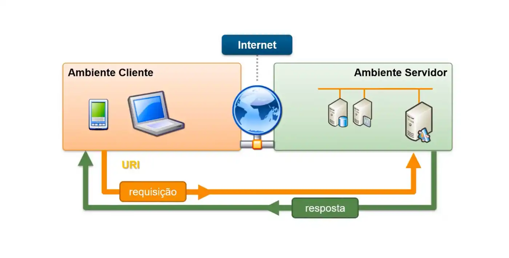
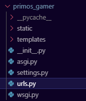
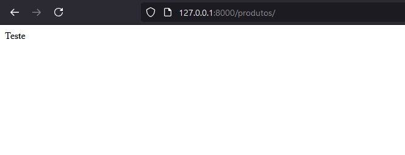
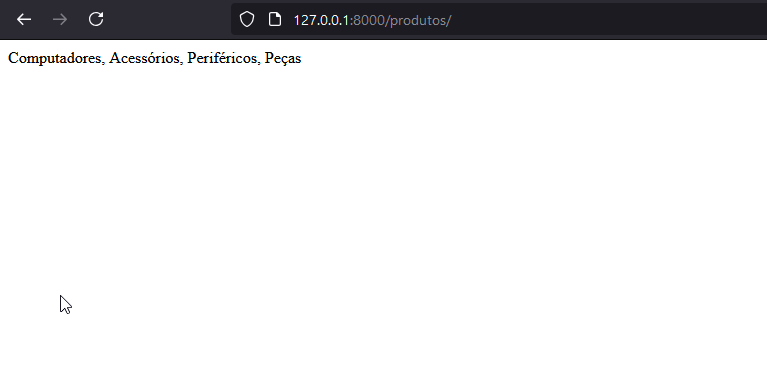

# Páginas
Aqui vamos ver como criar as primeiras páginas HTML do nosso sistema.

## Views
As views são as funções que contém a lógica do que vai aparecer nas nossas páginas. Aqui vamos carregar os dados, verificar permissões e preparar o que precisa aparecer pro usuário.

### Criando a primeira View
Nos **Apps** há um arquivo chamado *views.py*. É nele que colocaremos as nossas views. Vamos colocar adcionando uma view que apenas mostre um texto, vamos chamar ela de **index** por enquanto. Nesse exemplo vamos criar a view no **App** de produtos. Nós utilizaremos a classe **HttpResponse**, para isso vamos importá-la no topo do arquivo.

```python
# Essa importação deve ser feita no inicio do arquivo.
from django.http import HttpResponse

def index(request):
    return HttpResponse('Teste')
```

A primeira coisa que percebemos é que recebemos por parâmetro uma variável chamada request e retornamos uma classe chamada Response. Essa é uma característica do modelo de comunicação utilizado normalmente na internet. Nós chamamos de modelo Cliente-Servidor.



Nesse modelo nós temos o <ins>Cliente</ins>, que é a entidade que solicita alguma coisa. Essa solicitação pode ser por exemplo um arquivo, um dado ou endereço. Já a entidade que fornece o que foi solicitado é chamado de <ins>Servidor</ins>.
É importante entender esse conceito para entender em que ponta cada entidade se encontra em cada momento. No exemplo da imagem o celular ou o computador são os clientes que solicitam algo à um servidor na internet. Porém, caso seja necessário que esse servidor se comunique com outro servidor para obter as informações necessárias, durante essa comunicação o servidor que está fazendo a solicitação passa a ser o cliente daquela comunicação.

O pedido que o cliente faz é chamado de requisição (request) e a entrega desse pedido é chamado de resposta (response). Por essa razão temos nas nossas views sempre uma request e uma response.


### Configurando as URLs
Bom, nossa view está pronta, mas agora precisamos configurar qual o caminho que deve ser adicionado na URL para que possamos vê-la. As URLs do django funcionam de uma forma simples, mas é importante entender como URLs funcionam no geral.

Essa próxima sessão explica sobre URLs, mas se quiser pular direto para o código pode [clicar aqui](#urls-no-django).

#### Sobre URLs


Uma URL pode ser composta por alguns elementos:

- **Scheme**:
O Scheme define qual protocolo está sendo usado para acessar aquele recurso. HTTP é usado para páginas web, FTP é usado para arquivos, SMTP é usado para e-mail e assim vai. Essa informação é obrigatória, mas em navegadores atuais não é mais necessário escrever HTTP pois eles ja se encarregam de adicionar essa informação.

- **Domain**
O domain, ou domínio, é o nome do endereço do site. Normalmente é possível comprar domínios por serviços de hospedagem ou diretamente no [registro.br](https://registro.br/). Aqui é possível ver se um domínio já existe e quanto custa para obtê-lo. Domínios de fácil memorização costumam ser muito mais caros pois são endereços que todos querem por facilitar o site a ser encontrado. Apesar dessa informação ser obrigatória, o trecho WWW, que designa que aquele site está na internet, não precisa mais ser utilizado pois os navegadores modernos conseguem resolver esse direcionamento.

- **Port**
A porta é o que define o ponto de entrada de qualquer aplicação em rede. A porta nada mais é do que um local por onde o sistema vai receber ou enviar alguma informação. Quando usamos uma porta padrão ela não é necessária na URL, mas quando definimos uma porta diferente é obrigatório informá-la. Para requisições HTTP a porta padrão é a porta 80, para requisições HTTP (criptografada) é a porta 443. Lembre-se de que só pode existir uma aplicação por vez usando uma porta. Caso uma segunda aplicação tente usar aquela porta haverá uma mensagem de erro avisando que a porta já está em uso.

- **Path**
O caminho designa onde está o recurso utilizado. As barras podem servir para designar o caminho de pastas até um arquivo, ou pode designar um caminho virtual que é criado apenas para manter as informações organizadas. Caso estejamos trabalhando com caminhos absolutos (pastas e arquivos) é necessário colocar o nome do arquivo que está sendo requisitado e muitas vezes sua extensão. Mas se usarmos caminhos relativos ou virtuais podemos omitir o tipo do arquivo e até o nome.

- **Parameters**
Os parâmetros são informações opcionais que podemos colocar em uma URL. Apesar de serem opcionais para a URL, os parâmetros podem ser obrigatórios para a aplicação que estamos usando. Os parâmetros sempre ficam após o sinal de interrogação e são separados entre si por um "e" comercial (&). Cada parâmetro é composto por nome e valor formatado da seguinte forma: `nome=valor`.

- **Anchor**
A âncora é um marcador em uma página para facilitação de conteúdo. Quando adicionado em uma URL que chame uma página HTML, por exemplo, assim que a página for carregada o navegador irá correr o scroll até a posição da âncora designada. É possível também adicionar uma âncora para o mesmo documento. Por exemplo, se você [clicar aqui](#sobre-urls) o navegador fará a rolagem até o início desta sessão.

> [!IMPORTANT]
> No nosso projeto nós substituímos o domínio por `localhost` ou pelo IP `127.0.0.1`, esses dois endereços apontam para nossa própria máquina. Toda máquina reconhece ela mesma como `localhost` ou pelo IP `127.0.0.1`.
No django a porta que vem configurada é a porta `8000`, a ideia é evitar conflito caso o desenvolvedor já tenha algo usando a porta `80`.


#### URLs no Django
Agora precisamos configurar as URLs dentro do nosso projeto. Na pasta principal do projeto (primos_gamer) nós temos um arquivo chamado *urls.py*, é nele que faremos as configurações macro das nossas URLs.



De cara você verá o seguinte código:

```python
from django.contrib import admin
from django.urls import path

urlpatterns = [
    path('admin/', admin.site.urls),
]
```

A variável **urlpatterns** é um array com todos os possíveis caminhos do nosso sistema. Nele nós vemos que há apenas uma informação. Aqui está sendo criado um caminho `admin/` que está vinculado a outro arquivo de URLs. Basicamente ele está dizendo que quando adicionarmos o caminho `admin/` no fim da nossa URL ele irá procurar as URLs subsequentes dentro das URLs do admin. Dessa forma mantemos as URLs organizadas. 

Como estamos utilizando o **App** de produtos para nossa view, vamos adicionar aqui um caminho para ele. Você vai ver que dentro do **App** de produtos há um arquivo *urls.py* também. Nós vamos utilizar ele como centralizador das URLs de produto. Para fazer isso precisamos apenas importar a biblioteca `include` dentro do próprio pacote `django.urls`. Depois vamos adicionar nosso caminho e apontar para o arquivo de urls do nosso **App**.

```python
from django.contrib import admin
from django.urls import include, path

urlpatterns = [
    path('admin/', admin.site.urls),
    path("produtos/", include("produtos.urls")),
]
```

Agora, sempre que digitarmos a url `127.0.0.1:8000/produtos/` nós seremos redirecionados para os caminhos que criarmos dentro do nosso **App** de produtos. A posição dos caminhos definidos aqui na nossa lista são importantes. Aqueles que vierem primeiro terão prioridade na hora do Django procurar o caminho. Isso serve para que, caso haja dois caminhos iguais, ele consiga resolver sem apresentar um erro.

> [!WARNING]
> Pode ser que não haja um arquivo urls.py dentro do **App** assim que ele for criado. Se esse for o caso basta criar o arquivo adcionando a variável **urlpatterns** mesmo que inicialmente vazia.

Agora vamos olhar nosso arquivo de urls de produtos. Aqui vamos adcionar as importações do `path`, assim como no arquivo anterior e vamos importar nossas views também. Em seguida vamos vincular um caminho até a view que criamos.

```python
from django.urls import path
from produtos import views

urlpatterns = [
    path("", views.index, name="index"),
]
```

Aqui podemos ver que depois do caminho nós indicamos nossa view e depois definimos um nome para essa url. O caminho vazio define que queremos que chame essa view quando chamarmos a url `127.0.0.1:8000/produtos/` sem nada após produtos. Se a gente adicionar alguma coisa no caminho ela precisará estar contida na url. Por exemplo, se criarmos assim: `path("teste/", views.index, name="index")`, nós só conseguiremos acessar a view pela url `127.0.0.1:8000/produtos/teste`.

Agora vamos rodar a aplicação e cessar a url `127.0.0.1:8000/produtos/` conforme definimos no exemplo acima. O que vamos ver é o seguinte:



E viva! Já temos nossa primeira view. Agora vamos fazer algo mais complexo.

### Criando Views mais complexas

Vamos voltar para a nossa view e importar nosso model de Categorias. Vamos utilizar o model para consultar as categorias e listar na tela.

```python
from django.http import HttpResponse
# Importanto o model de Categoria
from produtos.models import Categoria

def index(request):
    lista_categorias = Categoria.objects.all()
    return HttpResponse(', '.join([c.nome for c in lista_categorias]))
```

Aqui estamos pegando todas as categorias do nosso banco com o comando **all** e salvando em uma lista. Caso não lembre como fazer consultas pode [conferir aqui](./DJANGO_MODELS.md#queries). Depois nós pegamos uma lista de nomes das categorias e concatenamos em uma string.

> [!TIP]
> Quando temos uma lista de objetos e queremos pegar apenas uma propriedade de cada objeto ou pegar apenas os objetos que atendem a uma condição nós podemos usar o que chamamos de List Comprehension. Basta colocar entre colchetes a seguinte estrutura: `[nome for nome in lista]` onde `nome` é uma variável criada para representar cada item da lista. Se quisermos pegar uma lista de propriedades em vez da lista de objetos podemos fazer assim? `[nome.propriedade for nome in lista]`. Para saber mais sobre list comprehension confira [esse site](https://www.w3schools.com/python/python_lists_comprehension.asp).

> [!TIP]
> A função join é utilizada para concatenar itens de um array usando um separador. Se tivermos um array `minha_lista = [1, 2 , 3]` e quisermos juntar em uma string separando utilizando o caracter "|" vamos fazer da seguinte forma: `'|'.join(minha_lista)` o resultado dessa operação é a seguinte string: "1|2|3". Para mais detalhes [veja aqui](https://www.w3schools.com/python/ref_string_join.asp)

Agora se salvarmos e dermos refresh na tela veremos os seguinte:



Podemos começar agora a criar telas mais complexas [utilizando Templates](./DJANGO_TEMPLATES.md).