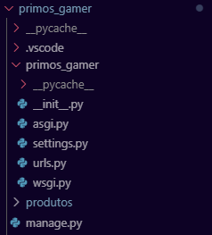

# Começando com Django
Aqui vamos entender como utilizar o django para desenvolvermos nossos projetos.

## Sobre o Django
O Django é um framework para desenvolvimento de aplicações web utilizando python. Ele contém todas as ferramentas necessárias para criar projetos completos. Nele vamos fazer comunicação com bancos de dados, montagem de telas automáticas, montagem de telas manuais dinâmicas e tratamento de segurança.

## Estrutura
Todo projeto Django possui uma pasta com o nome do projeto (primos_gamer) e um arquivo chamado *manage.py*.



O arquivo manage.py é onde executaremos os comandos básicos do Django, que nos permitirá desenvolver o projeto. Já na pasta com o nome do projeto temos alguns arquivos usados para configuração do sistema. O principal deles é o *settings.py* que contém todas as configurações do projeto.

Nós vamos realizar alterações no arquivo settings ao longo do projeto, por hora vamos realizar apenas duas alterações. A primeira é definir o idioma na variável **LANGUAGE_CODE** e a segunda definir o fuso horário na variável **TIME_ZONE**. Altere essas variáveis para que fique assim:
```python
LANGUAGE_CODE = 'pt-BR'

TIME_ZONE = 'America/Sao_Paulo'
```

## Apps
O django funciona separando partes diferentes do sistema em módulos chamados de **Apps**. Dentro de cada **App** teremos uma estrutura de arquivos que nos permitirá fazer tudo o que precisamos no projeto.

No nosso projeto, nesse primeiro momento, teremos 3 **Apps**. Um para tratarmos de produtos, um para tratarmos de clientes e um para tratarmos de pedidos. Conforme o projeto for avançando vamos criando mais **Apps**.

Para criar um novo app vamos utilizar o comando `python manage.py startapp <nomeapp>`.

## Instalando Dependências
Você deve ter percebido a existência de um arquivo abaixo do manage.py chamado requirements.txt. Nele temos todas as bibliotecas que precisam ser instaladas pro nosso projeto com a versão que precisamos. Estando dentro da VENV, execute o comando `pip install -r requirements.txt` para instalar os pacotes que permite executar o projeto.

>[!WARNING]
>Não esqueça de estar dentro do VENV quando for instalar pacotes. Se tiver dúvida veja [como ativar o VENV aqui](./CONFIG.md#comandos-do-venv).